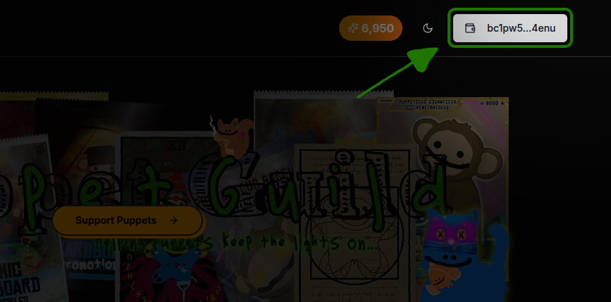
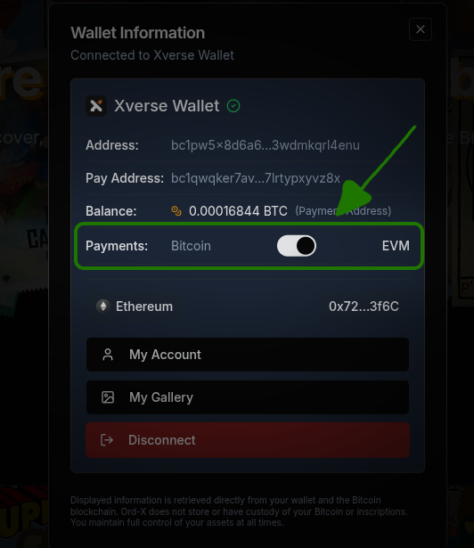
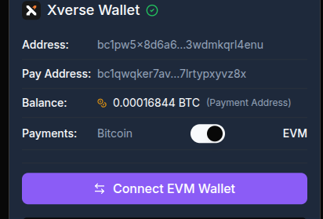

# EVM Payment Guide

By Proteux

## INTRODUCTION

We've integrated EVM payments to make minting on Ord-X even more flexible! Follow this step-by-step guide to mint your Bitcoin Ordinals using Ethereum or other EVM-compatible chains with ETH, USDC, or USDT.

## Step 1: Connect Your Bitcoin Wallet

Start by connecting your Bitcoin wallet. Click the "Connect Wallet" button on the top right of the page. Supported wallets include Unisat, Magic Eden, and Xverse. This wallet will receive your mintedg Ordinal. Then once you have connected your wallet, select that wallet button box again to pull up your wallet dialog.

## Step 2: Enable EVM Payments

Once your Bitcoin wallet is connected, click the wallet button in the top right corner again. Toggle the "EVM" switch to enable EVM payments. This allows you to pay using EVM-compatible chains.

## Step 3: Connect Your EVM Wallet

Once you have enabled EVM payments, the "Connect EVM Wallet" button will be enabled. Click it to connect your EVM wallet.

![Connect your wallet|style:full-width]

## Step 4: Select Your EVM Chain

By default, Ethereum is selected as the EVM chain. To change this, click the chain selector box (where it says "Ethereum") and choose your preferred EVM-compatible chain, such as Base or Arbitrum.

![Connect your wallet|style:full-width]

## Step 5: Choose Your Payment Token

Navigate to the item you want to mint. You'll now see options to pay with ETH, USDC, or USDT. Select your preferred token. If you choose USDC or USDT, you'll need to approve the spending of these tokens. The approval will request 2x the mint price to account for potential price changes, but only the actual mint cost will be spent.

![Connect your wallet|style:full-width]

## Step 6: Mint Your Item

After selecting your token (and approving if necessary), click the "Mint" button. The transaction will be processed on the EVM chain, and your Bitcoin Ordinal will be delivered to your connected Bitcoin wallet once the transaction is confirmed.

![Connect your wallet|style:full-width]
